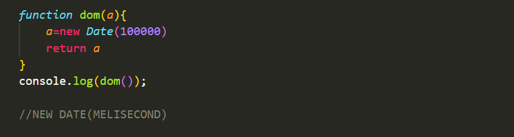

# lecture6

# DATA AND TIME

# В этом уроке вы узнаете о дате и время в JavaScript с помощью примеров.

### В JavaScript дата и время представлены объектом Date. Объект даты предоставляет информацию о дате и времени, а также предоставляет различные методы.Дата JavaScript определяет эпоху EcmaScript, которая представляет миллисекунды.с 1 января 1970 года по всемирному координированному времени. Эта дата и время совпадают с эпохой UNIX.(преобладающее базовое значение для записанных компьютером значений даты и времени).

# Существует четыре способа создания объекта даты

# • New Date()

# • New Date(миллисекунды)

# • New Date(строка даты)

# • New Date(год, месяц, день, часы, минуты, секунды,миллисекунды)

# New Date

# new date (milisecond)

## Объект Date содержит число, представляющее миллисекунды.с 1 января 1970 года по всемирному координированному времени. Новая дата (миллисекунды) Создает новый объект Date, добавив миллисекунды к нулевому времени. Для пример,

# New Date(Melesecond)

# New Date (string)

# New Date(year, month, day, hours, minutes, seconds milliseconds)

### Примечание. Если вы передадите только один аргумент, он будет считаться миллисекундами.Поэтому, чтобы использовать этот формат даты, вы должны передать два аргумента. В JavaScript, месяцы считаются от 0 до 11. Январь равен 0 и 11 декабря.Primechaniye. Yesli vy peredadite tol'ko odin argument, on budet schitat'sya millisekundami.Poetomu, chtoby ispol'

# • now() Возвращает числовое значение, соответствующее текущему времени (количество миллисекунд, прошедших с 1 января 1970 года 00:00:00 UTC).

# • getFullYear() Получает год по местному времени

# • getMonth() Получает месяцы, начиная с 0 из 11 по местному времени.

# • getDate() Получить день месяца (1-31) по местному времени

# • getDay() Получает день недели (0-6) по местному времени

# • getHours() Получает час от 0 до 23 по местному времени

# • getMinutes() Получает минуты от 0 до 59 по местному времени

# • getUTCDate() Получает день месяца (1-31) по всемирному времени

# • setFullYear() Устанавливает год дурака по местному времени

# •setMonth() Указывает месяц по местному времениУказывает месяц по местному времени

# • setDate() Устанавливает день месяца по местному времени

# • setUTCDate() Устанавливает день месяца по всемирному времени

##  
##
##
##
# THANKS DODARJON
